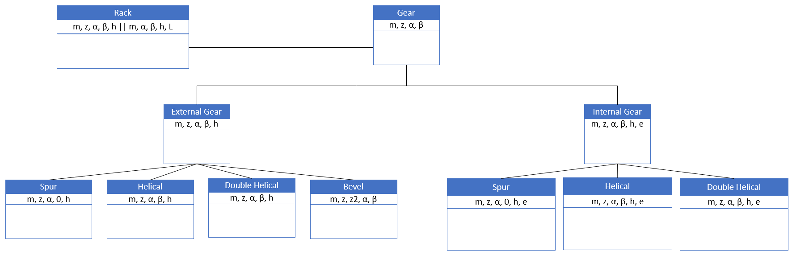

# GF-Gear-Generator
Main repo of the GF Gear Generator for Autodesk's Fusion 360.

Dear reader,

I am excited to share one of my earliest programming projects with you. When I embarked on this journey of learning programming, I poured my time and dedication into this project, which holds a special place in my heart. While the code quality may not be the best, the effort and genuine care invested in it are undeniable.

As of 17/05/2023, I have made the decision to release this project as an open-source endeavor. My aim is to invite the community to contribute and enhance it further, making it a collaborative effort that benefits everyone.

I truly believe that by opening up this project, we can collectively improve and refine it.

Thank you for joining me on this journey, and I look forward to witnessing the growth and evolution of this project together.

****************************************** 29/06/2023 Updates *************************************

The GFGG is about to undergo some great code quality improvements as it will follow the OOP structure I'm using for STLGears.com . To understand what will be changed I've added the UML diagram bellow so you can get an idea of the stuff that's to come:

